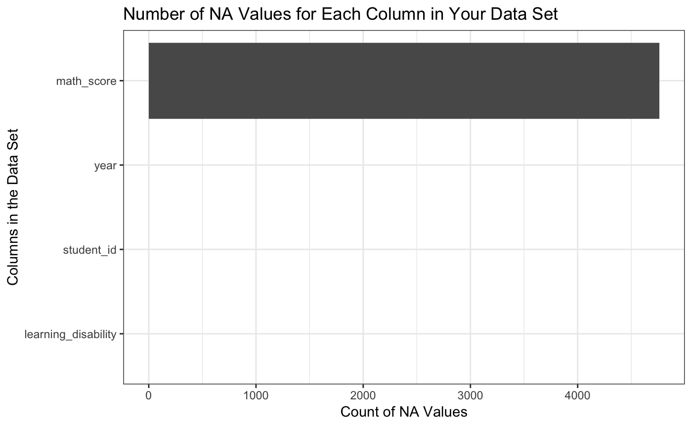
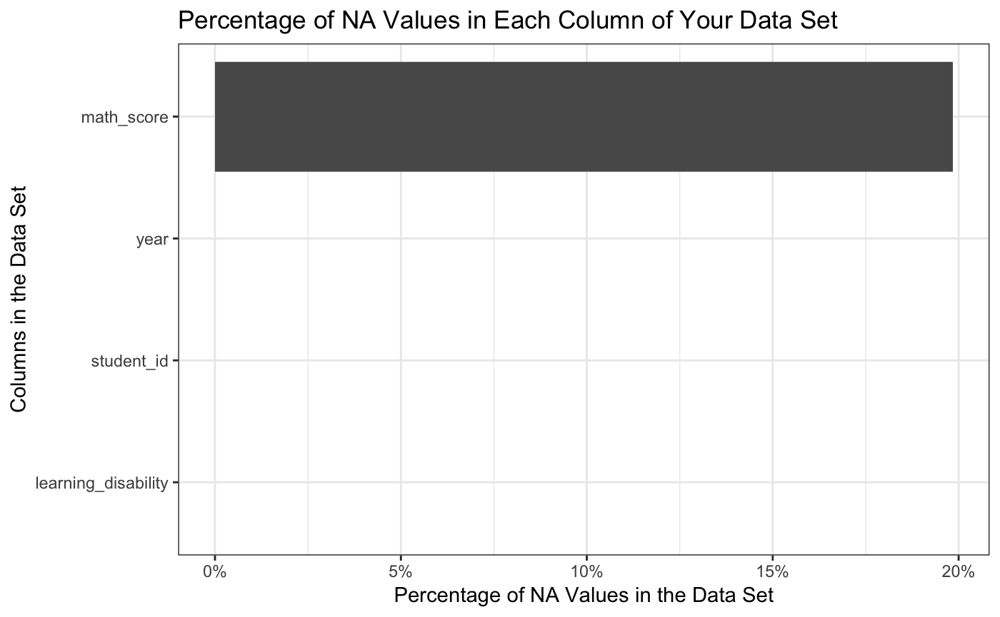
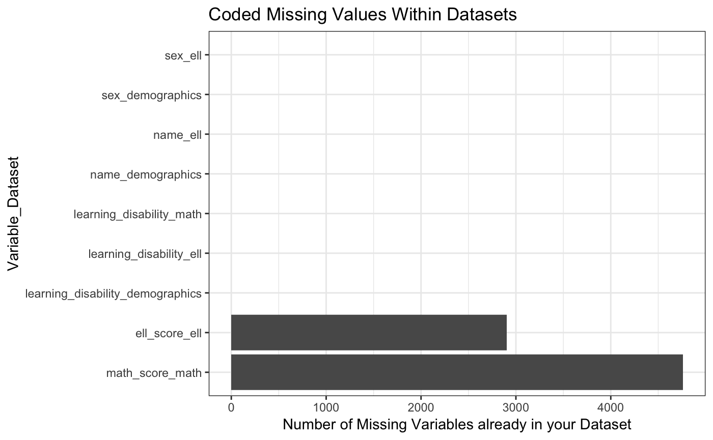
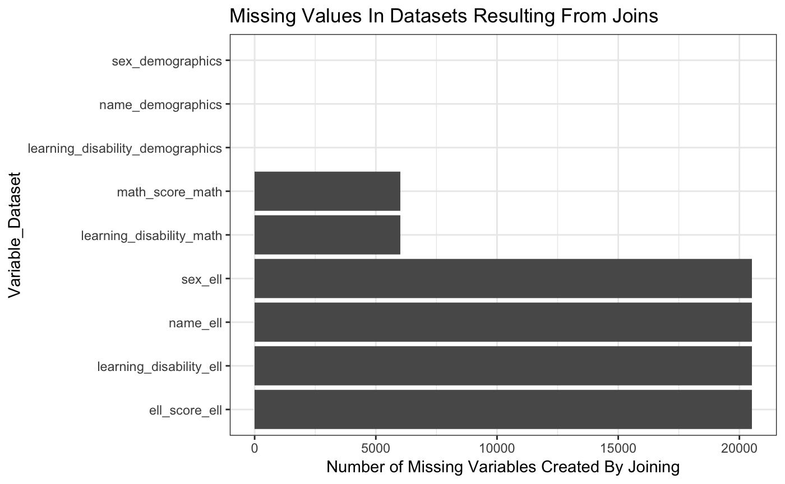

<!-- README.md is generated from README.Rmd. Please edit that file -->

# combineR

R package to understand overlap between multiple data frames and the
implications of different types of joins.

## Installation

You can install combineR from github with:

``` r
# install.packages("devtools")
devtools::install_github("stenhaug/combineR")
```

## Getting started

``` r
library(combineR)
library(tidyverse) # most useful with the tidyverse
#> ── Attaching packages ──────────────────────────── tidyverse 1.2.1 ──
#> ✔ ggplot2 3.0.0          ✔ purrr   0.2.5     
#> ✔ tibble  1.4.2          ✔ dplyr   0.7.5.9000
#> ✔ tidyr   0.8.1          ✔ stringr 1.3.1     
#> ✔ readr   1.1.1          ✔ forcats 0.3.0
#> ── Conflicts ─────────────────────────────── tidyverse_conflicts() ──
#> ✖ dplyr::filter() masks stats::filter()
#> ✖ dplyr::lag()    masks stats::lag()
```

## explain\_rows

explain\_rows gives the total number of rows, unique rows, and columns
in each data frame:

``` r
explain_rows(demographics, math, ell)
#> # A tibble: 3 x 4
#>   names        number_of_rows number_of_unique_rows number_of_columns
#>   <chr>                 <int>                 <int>             <int>
#> 1 demographics          30000                 30000                 5
#> 2 math                  24000                 24000                 4
#> 3 ell                    9483                  9483                 6
```

## explain\_NAs

explain\_NAs gives a report of nas in a data set

``` r
explain_NAs(math)
#> [[1]]
#> [1] "Here are the NA values in each column of the given dataframe, you have 24000 total rows in your dataset"
#> 
#> [[2]]
#>   number_of_NA_values            variable percentage_of_total_dataset
#> 1                4761          math_score                       19.84
#> 2                   0          student_id                        0.00
#> 3                   0                year                        0.00
#> 4                   0 learning_disability                        0.00
#> 
#> [[3]]
```

<!-- -->

    #> 
    #> [[4]]

<!-- -->

## count\_keys

The next function is count\_keys. You give this as many data frames as
you want and the key and it tells you how many unique values are in each
data frame for the keys you specify. Here it is done for all three
available datasets.

``` r
count_keys(demographics, math, ell, keys = c("student_id", "year"))
#> # A tibble: 30,000 x 5
#>    student_id  year demographics  math   ell
#>    <chr>      <dbl>        <int> <int> <int>
#>  1 S1000227    2015            1     1     0
#>  2 S1000227    2016            1     0     0
#>  3 S1000227    2017            1     1     0
#>  4 S1002738    2015            1     1     0
#>  5 S1002738    2016            1     1     0
#>  6 S1002738    2017            1     1     0
#>  7 S1003071    2015            1     1     0
#>  8 S1003071    2016            1     0     0
#>  9 S1003071    2017            1     1     0
#> 10 S100408     2015            1     0     0
#> # ... with 29,990 more rows
```

## get\_all\_missing

When we do joins, there are two types of missing values that come up.
The first are missing values that are hard coded. The second are missing
values that are generated when we do a join.

The get\_all\_missing function lets you specify all of the data frames
that you are interested in. You specify the keys (each data frame must
have at least one of the keys in it). And then it tells you if you were
to do all full\_joins, in which variables you would see missing values
and if they would come from being hard coded or from the join.

This function outputs a table and two plots to visualize the
information. Here, we chose to visualize the combination of all three
given datasets.

``` r
get_all_missing(demographics, math, ell, keys = c("student_id", "year"))
#> [[1]]
#> # A tibble: 9 x 3
#>   variable                         coded_missing join_missing
#>   <chr>                                    <int>        <int>
#> 1 name_demographics                            0            0
#> 2 sex_demographics                             0            0
#> 3 learning_disability_demographics             0            0
#> 4 learning_disability_math                     0         6000
#> 5 math_score_math                           4761         6000
#> 6 name_ell                                     0        20517
#> 7 sex_ell                                      0        20517
#> 8 learning_disability_ell                      0        20517
#> 9 ell_score_ell                             2904        20517
#> 
#> [[2]]
```

<!-- -->

    #> 
    #> [[3]]

<!-- -->

## Example insights

The goal of combineR is to generate insights like the following:

1.  There are a total of X unique students in the data.

2.  Y% of students in demographic data are in the ell data while Z% of
    students in the state test data are in the math data.

3.  If we want to create a completely non-missing dataset that includes
    gender and age from state demographics data, ell score and student
    id from ell data, and math score from the math data this will
    include XX students. YY students were dropped because they were in
    the demographic data but in neither of the other data sets. ZZ
    students were in all three data frames but had an NA in the math
    score variable from the math data.
